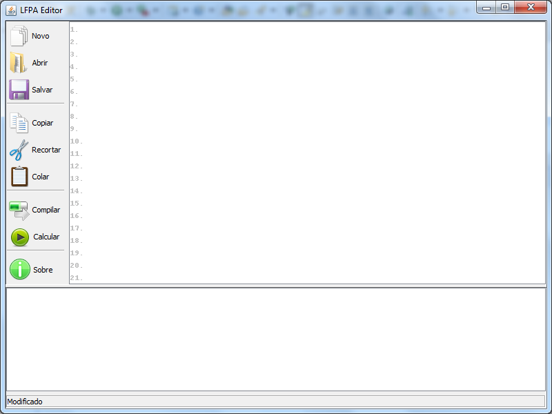
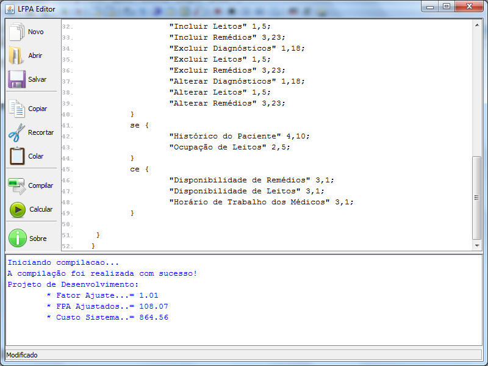

# LFPA

LFPA is a language that helps to describe the FPA count. The language for words reserved for the language is Portuguese.

## Getting Started

A simple editor:



A simple example:

```
projeto Exemplo01 desenvolvimento {
	prog seguranca {
		aie "Chave Criptografica" 7,3;
		:2 3;
		:reutilizacao 5;
	}
	prog exe01 estende prog seguranca {
		:1 5;
		:3 1;
		:4 1;
		:5 4;
		:6 1;
		:7 4;
		:8 1;
		:9 1;
		:11 1;
		:12 1;
		:13 4;
		:14 1;

	ali {
		"Diagnosticos" 1,18;
		"Leitos" 1,5;
		"Remedios" 3,23;
	}
	aie {
		"Médicos  " 1,31;
		"Pacientes" 1,16;
	}
	ee {
		"Incluir Diagnósticos" 1,18;
		"Incluir Leitos" 1,5;
		"Incluir Remédios" 3,23;
		"Excluir Diagnósticos" 1,18;
		"Excluir Leitos" 1,5;
		"Excluir Remédios" 3,23;
		"Alterar Diagnósticos" 1,18;
		"Alterar Leitos" 1,5;
		"Alterar Remédios" 3,23;
	}
	se {
		"Histórico do Paciente" 4,10;
		"Ocupação de Leitos" 2,5;
	}
	ce {
		"Disponibilidade de Remédios" 3,1;
		"Disponibilidade de Leitos" 3,1;
		"Horário de Trabalho dos Médicos" 3,1;
	}

 }
}
```

* Performing the calculation:



## We have a simple stack:
* Java
* GALS
* Maven
